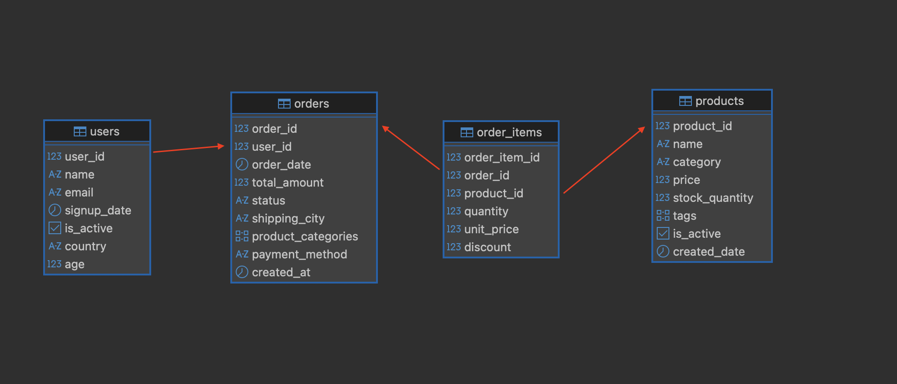
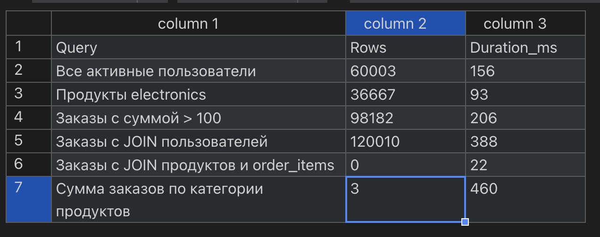

# Trino with Iceberg, Postgres, and MinIO

This project demonstrates using **Trino** with an **Iceberg connector**, a **Postgres metastore**, and **MinIO** for object storage.  
The database is pre-populated with **~100,000 records** in each main table to allow testing query performance under load.

## Architecture Overview

- **MinIO**: Object storage for Iceberg tables.
- **Postgres**: Metastore for Iceberg.
- **Trino**: Query engine for running SQL on Iceberg tables stored in MinIO.

### ERD Diagram



### Test Data



## Starting the Services

Start everything up:

````bash
docker compose up -d


Stop and remove the containers and network:

```shell
docker compose down
````
